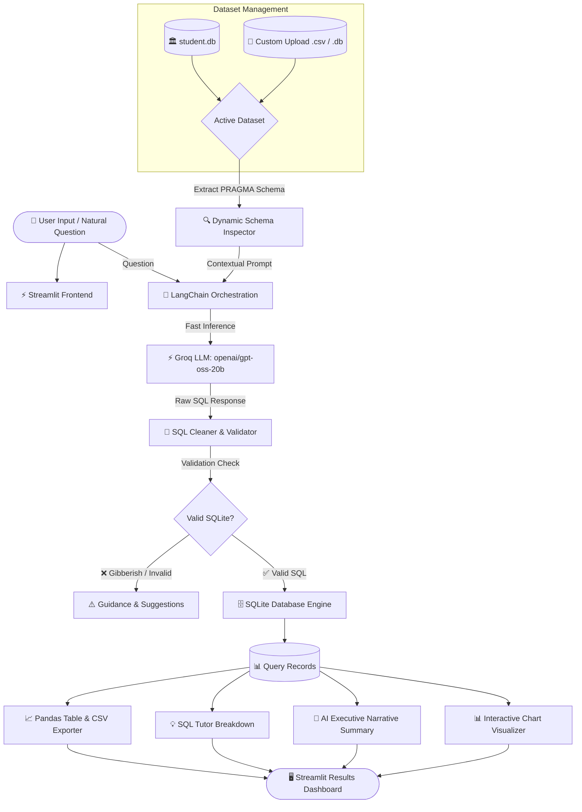

# ⚡ SQLGenie AI: Enterprise Text-to-SQL Assistant & Analytics Suite

[](https://www.python.org/)
[](https://streamlit.io/)
[](https://www.langchain.com/)
[](https://groq.com/)
[](https://www.sqlite.org/)
[](LICENSE)

**SQLGenie AI** is a full-stack, enterprise-grade data intelligence application that translates natural English questions into accurate, production-ready SQL queries, executes them in real time on SQLite databases, and transforms raw rows into actionable business intelligence.

Built with **Streamlit**, **LangChain**, and high-speed **Groq LLMs**, SQLGenie AI features dynamic schema grounding, holographic processing animations, interactive data visualizers, and direct multi-format dataset uploads (`.csv`, `.db`, `.sqlite`).

---

## 🌟 Key Features

### 1. 💬 Intelligent AI Query Assistant
- **Zero-Shot Natural Language to SQL:** Converts complex natural language queries into optimized SQLite syntax.
- **Dynamic Schema Grounding:** Automatically extracts real-time table schemas, column names, data types, and row counts (`PRAGMA table_info`) to prevent hallucinations.
- **Gibberish & Malicious Input Guardrails:** Actively screens inputs against non-queries, random strings, and mutating operations to safeguard your database.
- **💡 Plain-English SQL Tutor:** Breaks down generated queries clause-by-clause (`SELECT`, `FROM`, `WHERE`, `GROUP BY`, `ORDER BY`, `LIMIT`) so non-technical users can understand the logic.
- **🧠 AI Executive Narrative Summary:** Synthesizes query output into concise, high-impact business takeaways, highlighting key statistics, top performers, and anomalies.
- **Dynamic Question Chips:** Context-aware suggestion chips generated directly from your active table columns.
- **One-Click CSV Export:** Download query outputs directly with a single click.

### 2. 📊 Database Explorer & Interactive Visualizer
- **Complete Schema Inspector:** View all tables, column types, and total record counts via responsive pill badges.
- **Live Table Browser:** Browse up to 1,000 records with sorting, filtering, and instant full-table CSV downloads.
- **Automated Summary Statistics:** Instant numeric distribution metrics (`count`, `mean`, `std`, `min`, `max`, `quartiles`).
- **No-Code Chart Builder:** Build custom Bar, Line, and Area charts dynamically with custom X-axis categories and Y-axis numeric metrics.

### 3. 🛠️ Direct SQL Playground
- **Interactive SQL Console:** Direct SQL execution interface for database administrators and power users.
- **Instant Result Rendering:** View execution outputs in clean, paginated dataframes with row counts and error diagnostics.

### 4. 📁 Dual-Mode Dataset Management
- **Built-In Student Database:** Out-of-the-box educational database (`student.db`) pre-populated with student records across Data Science and DevOps tracks.
- **Custom Dataset Uploader:** Drag-and-drop your own `.csv`, `.db`, or `.sqlite` files. CSV files are automatically converted into sanitized, indexed SQLite tables on the fly.
- **Memory & Resource Cleanup:** Automated memory management and one-click removal of uploaded datasets.

### 5. 🎨 Modern Cyberpunk / Holographic UI
- Designed with **Google Outfit Typography**, modern dark-mode glassmorphism, responsive metrics, animated laser scanners, and pulsing cosmic processing orbs during LLM inference.

---

## 🏗️ Architecture Workflow



---

## 📂 Project Directory Structure

```text
textToSQL/
│
├── app.py                 # Core Streamlit application (UI, LLM chains, visualizer)
├── database.py            # SQLite seed script to generate sample student.db
├── student.db             # Pre-built SQLite database with sample student records
├── requirements.txt       # Production dependencies (Streamlit, LangChain, Groq, Pandas)
├── .env.example           # Template for required environment variables
├── .env                   # Local secrets (API keys) - [Ignored by Git]
├── .gitignore             # Git ignore file protecting keys, venv, and cache
└── README.md              # Comprehensive project documentation
```

---

## 🚀 Getting Started

### 1. Prerequisites
- **Python 3.10+** installed on your system.
- A free **Groq API Key** from [console.groq.com](https://console.groq.com/).

### 2. Clone the Repository
```bash
git clone https://github.com/sanjuDiatm-design/Text_To_SQL.git
cd Text_To_SQL
```

### 3. Create & Activate Virtual Environment

**Windows (PowerShell):**
```powershell
python -m venv venv
.\venv\Scripts\Activate.ps1
```

**macOS / Linux:**
```bash
python3 -m venv venv
source venv/bin/activate
```

### 4. Install Dependencies
```bash
pip install -r requirements.txt
```

### 5. Configure Your API Key
Create a `.env` file in the root folder (or copy from `.env.example`):
```bash
cp .env.example .env
```
Open `.env` and insert your Groq API key:
```env
GROQ_API_KEY=gsk_your_actual_groq_api_key_here
```

### 6. Initialize Sample Database (Optional)
To regenerate or inspect the default `student.db`:
```bash
python database.py
```

### 7. Launch the Application
```bash
streamlit run app.py
```
Open your browser at: **`http://localhost:8501`**

---

## 💡 How to Use

### 💬 Asking Questions (AI Assistant)
1. Select one of the quick suggestions or type your question:
   - *"Show all students in Data Science with marks greater than 85"*
   - *"Which student scored the highest marks?"*
   - *"What is the average marks per section?"*
2. Toggle additional intelligence options:
   - **🧠 AI Narrative Summary:** Get a written executive takeaway of the results.
   - **💡 Explain SQL Query:** Learn how each SQL clause was constructed.
   - **🎈 Celebration Animation:** Enjoy celebratory visuals when queries succeed.
3. Click **🚀 Run AI Query**.

### 📁 Uploading Your Own Data
1. Open the left **Sidebar**.
2. Under **Dataset Source**, drop any `.csv`, `.db`, or `.sqlite` file.
3. The app automatically scans your file, indexes its tables, and updates prompt context immediately!

### 📊 Visualizing Analytics
1. Navigate to the **Database Explorer & Analytics** tab.
2. Select your desired table to view its full schema and summary statistics.
3. Use the **Interactive Chart Builder** to plot Bar, Line, or Area charts on any column combinations.

### 🛠️ Direct SQL Playground
1. Switch to the **Direct SQL Playground** tab.
2. Write raw SQLite statements (e.g. `SELECT COURSE, AVG(MARKS) FROM STUDENT GROUP BY COURSE;`).
3. Click **⚡ Execute SQL** to inspect output tables directly.

---

## 🛡️ Security & Quality Best Practices

- **Strict API Key Protection:** `.env` is permanently excluded from version control via `.gitignore`.
- **SQL Sanitization:** Markdown code fences, backticks, and extra whitespace are automatically stripped before execution.
- **Read-Only Enforcements:** The query validator requires data-retrieval keywords (`SELECT`, `WITH`, `PRAGMA`, `EXPLAIN`) and filters out dangerous statements.
- **Resource Cleanup:** Automated garbage collection (`gc.collect()`) prevents database file-lock issues on Windows environments.

---

## 🧰 Built With

- **[Streamlit](https://streamlit.io/)** — Rapid frontend UI & reactive state management.
- **[LangChain](https://www.langchain.com/)** — Prompt engineering, LLM orchestration, and output parsing.
- **[Groq Cloud](https://groq.com/)** — Ultra-fast LPU inference (`openai/gpt-oss-20b`).
- **[SQLite3](https://www.sqlite.org/)** — Embedded serverless relational database engine.
- **[Pandas](https://pandas.pydata.org/)** — High-performance data manipulation and CSV handling.

---

## 📄 License

This project is licensed under the MIT License - see the [LICENSE](LICENSE) file for details.

---

## 👨‍💻 Author

Developed with ❤️ by **[Sanju Ghosh](https://github.com/sanjuDiatm-design)**.  
Feedback, issues, and pull requests are warmly welcomed!
